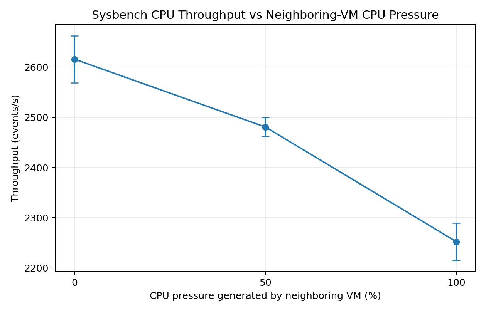
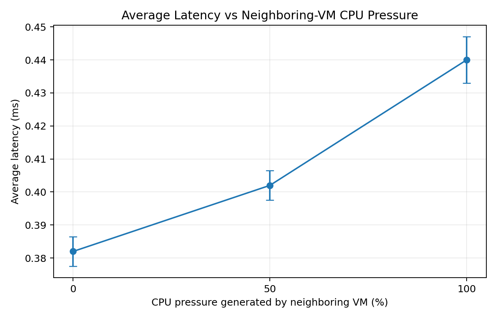
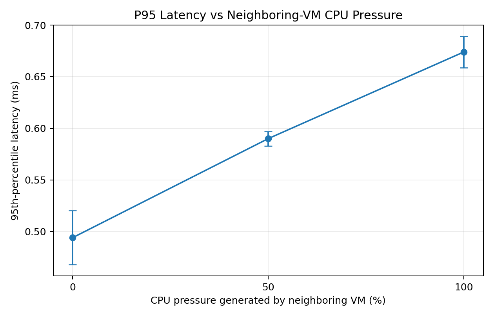

# Virtualization Performance Lab

A reproducible systems-performance project investigating how **CPU pressure generated by a neighboring virtual machine affects the performance of a benchmark workload running in another VM**.

This repository is part of my independent research portfolio in:

- High-Performance Computing
- Distributed Systems
- Virtualization
- Resource Contention
- Performance Engineering
- HPC–Cloud Convergence

> **Status:** Active research project  
> **Current stage:** Pilot study completed; expanded 25% / 75% conditions and larger-sample formal experiments planned.

---

## 1. Research Question

**How does CPU pressure generated by a neighboring virtual machine affect throughput and latency in a benchmark virtual machine?**

The current experiment uses a two-VM setup:

- **VM1 (`benchmark-vm`)** runs a CPU benchmark.
- **VM2 (`contention-vm`)** generates synthetic CPU load with `stress-ng`.
- VM1 performance is measured under different configured CPU-load levels in VM2.

The current pilot compares:

- **0%** configured load in VM2 (baseline)
- **50%** configured load in VM2
- **100%** configured load in VM2

The 50% and 100% values refer to the `stress-ng --cpu-load` configuration **inside the neighboring VM**. They do **not** represent measured total host CPU utilization.

---

## 2. Motivation

Virtualized infrastructure allows multiple workloads to share the same physical machine.

This improves resource utilization, but it can also create **noisy-neighbor effects** when virtual machines compete indirectly for host CPU resources.

Such interference may cause:

- lower throughput;
- higher execution time;
- increased average latency;
- increased tail latency;
- reduced performance predictability.

These effects are relevant to:

- cloud computing;
- multi-tenant systems;
- performance isolation;
- virtualized HPC environments;
- resource-aware scheduling;
- HPC–cloud convergence.

---

## 3. Experimental Environment

### Host System

- **Host OS:** Windows 10 Enterprise
- **CPU:** Intel Core i3-1005G1 @ 1.20 GHz
- **Physical cores:** 2
- **Logical processors:** 4
- **RAM:** 8 GB
- **Hypervisor:** VMware Workstation
- **Hardware virtualization:** Enabled in firmware

### VM1 — Benchmark VM

- **Hostname:** `benchmark-vm`
- **Guest OS:** Ubuntu Server 24.04 LTS
- **Kernel:** `6.8.0-138-generic`
- **vCPU:** 1
- **RAM:** 2 GB nominal
- **Primary tool:** `sysbench 1.0.20`
- **Additional tools:** GCC 13.3.0, Python 3.12.3

### VM2 — Contention VM

- **Hostname:** `contention-vm`
- **Guest OS:** Ubuntu Server 24.04 LTS
- **Kernel:** `6.8.0-138-generic`
- **vCPU:** 2
- **RAM:** 2 GB nominal
- **Primary tool:** `stress-ng 0.17.06`

Full setup details are documented in:

[`docs/experimental-setup.md`](docs/experimental-setup.md)

---

## 4. Experimental Design

The current pilot uses the following structure:

```text
Windows 10 Enterprise Host
Intel Core i3-1005G1
8 GB RAM
VMware Workstation
        |
        +----------------------+
        |                      |
 benchmark-vm            contention-vm
  1 vCPU / 2 GB           2 vCPU / 2 GB
        |                      |
    sysbench                 stress-ng
        |                      |
        +----------+-----------+
                   |
           Performance impact
```

### Benchmark workload

VM1 runs:

```bash
sysbench cpu --threads=1 --time=30 run
```

### Contention workload

For the 50% condition:

```bash
stress-ng --cpu 2 --cpu-load 50 --timeout 240s
```

For the 100% condition:

```bash
stress-ng --cpu 2 --cpu-load 100 --timeout 240s
```

The baseline condition keeps VM2 powered on but idle.

---

## 5. Repetition Strategy

The current pilot uses:

- **5 repetitions per condition**
- **30 seconds per sysbench run**
- short pauses between benchmark runs
- the same benchmark configuration across all conditions

Current pilot size:

```text
3 conditions × 5 repetitions = 15 benchmark runs
```

The next stage will expand the experiment to include **25% and 75% configured load**, followed by a larger number of repetitions per condition.

---

## 6. Pilot Development and Methodological Revision

The experiment went through two preliminary stages before the current pilot.

### Pilot 1 — Unconstrained VMware scheduling

An initial test with one vCPU assigned to each VM showed measurable interference, but the 25% contention condition had noticeably higher variability than the baseline.

This suggested that host scheduling behavior could be an important confounding factor.

### Rejected affinity experiment

A later attempt restricted both complete `vmware-vmx.exe` processes to one Windows logical processor using process-level CPU affinity.

This produced highly unstable baseline performance and was therefore rejected.

The key lesson was that Windows process-level affinity constrains the entire VMware VMX process rather than precisely pinning only the guest vCPU execution thread.

The final pilot therefore returned VMware Workstation to its default host scheduling behavior and increased the contention VM to **2 vCPUs** in order to generate more consistent host-level CPU pressure.

This methodological change produced substantially more stable and interpretable results.

---

## 7. Pilot Results

### Summary

| Neighboring-VM configured CPU load | Throughput (events/s) | Throughput change vs baseline | Avg latency (ms) | Avg latency change | P95 latency (ms) | P95 change |
|---:|---:|---:|---:|---:|---:|---:|
| **0%** | **2615.81 ± 46.69** | — | **0.382** | — | **0.494** | — |
| **50%** | **2480.66 ± 18.83** | **−5.17%** | **0.402** | **+5.24%** | **0.590** | **+19.43%** |
| **100%** | **2252.28 ± 37.03** | **−13.90%** | **0.440** | **+15.18%** | **0.674** | **+36.44%** |

Values are reported as mean ± sample standard deviation where applicable, with **n = 5** runs per condition.

### Throughput stability

The coefficient of variation (CV) for throughput was:

- **Baseline:** 1.78%
- **50% condition:** 0.76%
- **100% condition:** 1.64%

This suggests that the current pilot configuration produced reasonably stable repeated measurements.

---

## 8. Key Observations

### 8.1 Throughput decreased as neighboring-VM CPU load increased

Mean throughput declined from:

```text
2615.81 events/s  →  2480.66 events/s  →  2252.28 events/s
      0%                   50%                  100%
```

Relative to baseline:

- 50% configured load reduced throughput by **5.17%**
- 100% configured load reduced throughput by **13.90%**

---

### 8.2 Average latency increased

Mean latency increased from:

```text
0.382 ms  →  0.402 ms  →  0.440 ms
```

Relative to baseline:

- 50% configured load increased mean latency by **5.24%**
- 100% configured load increased mean latency by **15.18%**

---

### 8.3 P95 latency increased more strongly than average latency

P95 latency increased from:

```text
0.494 ms  →  0.590 ms  →  0.674 ms
```

Relative to baseline:

- 50% configured load increased P95 latency by **19.43%**
- 100% configured load increased P95 latency by **36.44%**

In this pilot, the increase in P95 latency was substantially larger than the increase in mean latency.

This **suggests** that CPU interference may affect tail latency and performance predictability more strongly than average latency in this experimental setup.

This is a preliminary observation rather than a general causal conclusion.

---

## 9. Figures

### Throughput vs neighboring-VM CPU load



### Average latency vs neighboring-VM CPU load



### P95 latency vs neighboring-VM CPU load



---

## 10. Data and Analysis

### Raw data

Raw sysbench outputs are preserved without manual modification:

```text
results/raw/pilot_v2/
```

The directory contains:

- 5 baseline runs
- 5 runs at 50% configured neighboring-VM CPU load
- 5 runs at 100% configured neighboring-VM CPU load

### Processed data

Generated files:

```text
results/processed/pilot_v2_results.csv
results/processed/pilot_v2_summary.csv
```

### Analysis script

The analysis is automated with:

```text
analysis/analyze_results.py
```

Run from the repository root:

```bash
python3 analysis/analyze_results.py
```

The script:

- parses raw sysbench output;
- extracts throughput and latency metrics;
- calculates mean, median, sample SD and CV;
- calculates changes relative to baseline;
- writes per-run and summary CSV files;
- generates the figures shown above.

---

## 11. Repository Structure

```text
virtualization-performance-lab/
│
├── README.md
│
├── analysis/
│   └── analyze_results.py
│
├── scripts/
│   ├── run_baseline.sh
│   ├── run_medium.sh
│   └── run_heavy.sh
│
├── results/
│   ├── raw/
│   │   └── pilot_v2/
│   │       ├── baseline_run_1.txt
│   │       ├── ...
│   │       ├── medium_50_run_1.txt
│   │       ├── ...
│   │       ├── heavy_100_run_1.txt
│   │       └── ...
│   └── processed/
│       ├── pilot_v2_results.csv
│       └── pilot_v2_summary.csv
│
├── figures/
│   ├── throughput_vs_pressure.png
│   ├── avg_latency_vs_pressure.png
│   └── p95_latency_vs_pressure.png
│
└── docs/
    └── experimental-setup.md
```

---

## 12. Current Limitations

The current results should be interpreted as a **small-scale pilot study**.

### 12.1 Small sample size

Only five repetitions were collected for each condition.

A larger formal experiment is planned.

### 12.2 Laptop-class host

The experiment runs on a mobile Intel processor with:

- dynamic frequency scaling;
- Turbo Boost;
- thermal constraints;
- limited physical core count.

These factors may influence performance over time.

### 12.3 VMware Workstation on Windows

The host uses VMware Workstation on Windows 10 rather than a server-oriented hypervisor such as KVM or Proxmox.

Precise guest vCPU pinning was not used in the accepted pilot configuration.

### 12.4 `stress-ng --cpu-load` is a configured guest workload

The 50% and 100% values describe the configured CPU load of `stress-ng` workers **inside VM2**.

They do not directly measure:

- total Windows host CPU utilization;
- the exact fraction of shared physical CPU time;
- the precise amount of interference experienced by VM1.

### 12.5 Sysbench latency resolution

The sysbench output used here reports latency values with limited decimal precision.

A custom benchmark with finer-grained timing would provide better tail-latency analysis.

### 12.6 Potential thermal and temporal confounding

Runs were collected sequentially.

Changes in:

- CPU temperature;
- sustained power limits;
- host background activity;
- CPU frequency;

may correlate with experiment order.

A future formal experiment will use a rotated or randomized condition order.

---

## 13. Planned Next Steps

### Expand contention levels

Add:

- 25% configured VM2 CPU load
- 75% configured VM2 CPU load

to create the full pilot curve:

```text
0% → 25% → 50% → 75% → 100%
```

### Increase repetitions

Increase from 5 to approximately 10–20 repetitions per condition.

### Improve experiment ordering

Use a rotated or randomized condition order to reduce correlation between:

- contention level;
- experiment time;
- host temperature.

### Add custom latency benchmark

Develop a small C benchmark with finer-grained timing to calculate:

- p50;
- p95;
- p99;
- full latency distributions.

### Collect host/system metrics

Potential additions include:

- CPU utilization;
- CPU frequency;
- CPU steal time where applicable;
- context switches;
- CPU migrations;
- cache misses;
- host temperature.

### Extend resource-interference experiments

Future stages may investigate:

- memory contention;
- storage contention;
- network contention;
- CPU affinity;
- SMT / Hyper-Threading effects;
- Docker vs VM isolation;
- virtualized HPC workloads.

---

## 14. Relationship to My Previous HPC Work

This project extends my previous M.Sc. work in High Performance Computing at Trinity College Dublin.

My M.Sc. project implemented:

- serial C;
- OpenMP;
- MPI;
- 3D Laplace / Gauss–Seidel computation;
- MPI halo exchange;
- Docker-based execution;
- strong-scaling analysis.

Related repository:

[HaoboSu/hpc-thesis-project](https://github.com/HaoboSu/hpc-thesis-project)

The current project shifts the focus from parallelization itself toward:

- virtualization;
- noisy-neighbor interference;
- performance isolation;
- workload predictability;
- systems performance engineering.

---

## 15. Data Integrity and Confidentiality

All experiments in this repository use:

- the author's personal computer;
- self-created virtual machines;
- synthetic workloads;
- publicly reproducible tools and configurations.

**No proprietary company infrastructure, customer information, production configuration, internal monitoring data, or confidential system details are included.**

---

## Author

**Haobo Su**

M.Sc. High Performance Computing — Trinity College Dublin

Research interests:

- High-Performance Computing
- Distributed Systems
- Virtualization
- Containerized Computing
- Performance Engineering
- Resource Isolation
- HPC–Cloud Convergence

GitHub: [HaoboSu](https://github.com/HaoboSu)
