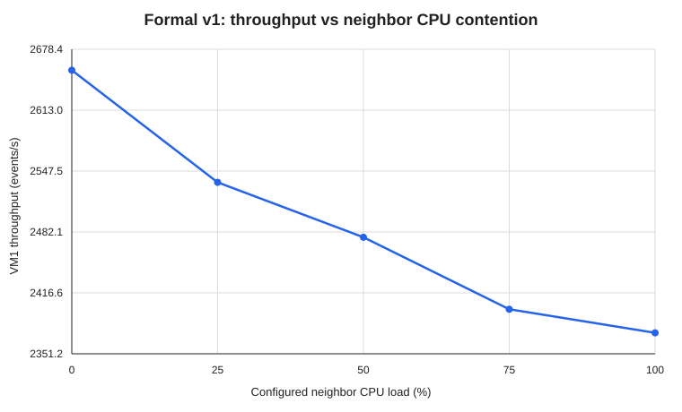
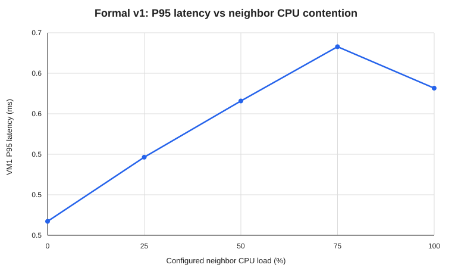
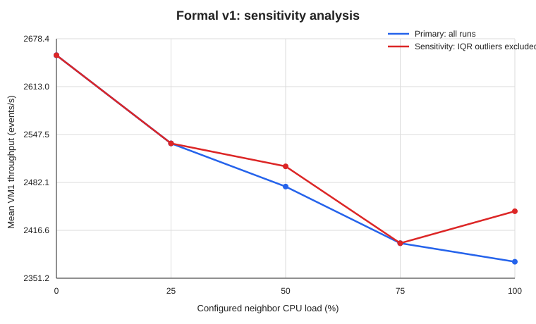

# Virtualization Performance Lab

A reproducible systems-performance project investigating how **CPU pressure generated by a neighboring virtual machine affects the performance of a benchmark workload running in another VM**.

This repository is part of an independent research portfolio in:

- High-Performance Computing
- Distributed Systems
- Virtualization
- Resource Contention
- Performance Engineering
- HPC–Cloud Convergence

> **Status:** Formal-v1 data collection and final analysis complete  
> **Current stage:** **50/50 scheduled benchmark trials completed and validated**, with 10 matched blocks across five configured neighbor-load levels and 40 paired VM2 contention logs. Final descriptive, repeated-measures, and sensitivity results are archived in [`docs/formal-v1-results.md`](docs/formal-v1-results.md).

The pilot and smoke-test records remain in the repository as methodological-development and validation artifacts. Formal-v1 is now the primary result set.

---

## 1. Research Question

**How does CPU pressure generated by a neighboring virtual machine affect throughput, latency, and performance variability in a benchmark virtual machine?**

The experiment uses two VMs on one VMware Workstation host:

- **VM1 (`benchmark-vm`)** runs a CPU benchmark with `sysbench`.
- **VM2 (`contention-vm`)** generates synthetic CPU load with `stress-ng`.
- VM1 is measured while VM2 is configured at **0%, 25%, 50%, 75%, or 100%** CPU load.

The configured `stress-ng --cpu-load` value is an experimental control **inside VM2**. It is not a direct measurement of total host CPU utilization.

---

## 2. Experimental Environment

### Host

- Windows 10 Enterprise
- Intel Core i3-1005G1 @ 1.20 GHz
- 2 physical cores / 4 logical processors
- 8 GB RAM
- VMware Workstation

### VM1 — Benchmark VM

- Ubuntu Server 24.04 LTS
- 1 vCPU / 2 GB RAM
- `sysbench 1.0.20`
- Formal-v1 kernel: `6.8.0-139-generic`

### VM2 — Contention VM

- Ubuntu Server 24.04 LTS
- 2 vCPU / 2 GB RAM
- `stress-ng 0.17.06`
- Formal-v1 kernel: `6.8.0-139-generic`

Detailed setup: [`docs/experimental-setup.md`](docs/experimental-setup.md)

---

## 3. Formal-v1 Design

Formal-v1 follows the blocked-randomized protocol in [`docs/formal-experiment-protocol.md`](docs/formal-experiment-protocol.md).

VM1 benchmark:

```bash
sysbench cpu --threads=1 --time=30 run
```

VM2 uses two `stress-ng` CPU workers with the `int64` method and a 120-second contention window. The baseline keeps VM2 powered on but idle.

Five load levels × ten matched blocks:

```text
5 conditions × 10 repetitions = 50 VM1 benchmark trials
4 contention levels × 10 repetitions = 40 VM2 contention logs
```

Run numbers 1–10 form matched blocks, so the final analysis treats the design as repeated / paired rather than as 50 fully independent observations.

---

## 4. Formal-v1 Results

| Neighbor CPU load | Mean throughput (events/s) | Change vs baseline | Mean P95 latency (ms) | Throughput CV |
|---:|---:|---:|---:|---:|
| 0% | 2655.85 | — | 0.466 | 1.75% |
| 25% | 2535.40 | -4.54% | 0.531 | 3.74% |
| 50% | 2476.35 | -6.76% | 0.588 | 4.39% |
| 75% | 2399.01 | -9.67% | 0.643 | 5.01% |
| 100% | 2373.76 | -10.62% | 0.601 | 10.22% |

Mean throughput falls from **2655.85 events/s** at baseline to **2373.76 events/s** at 100% configured neighbor load, a reduction of **10.62%**.

Throughput variability also increases: CV rises from **1.75%** at baseline to **10.22%** at 100% load.

P95 latency increases overall under contention, although adjacent levels overlap and the 100% mean is below the 75% mean. The result is therefore best described as **contention-induced performance degradation and increased variability**, not a perfectly deterministic step-by-step slowdown.

### Repeated-measures evidence

Friedman tests detect differences across the five load levels for:

- throughput: **χ² = 28.16, p = 1.16e-05**
- P95 latency: **χ² = 29.41, p = 6.46e-06**

Paired comparisons against the same-run baseline remain statistically distinguishable after Holm correction for all four contention levels.

### Sensitivity analysis

The within-load IQR rule flags two low-throughput observations:

- 50% / run 6: **2227.69 events/s**
- 100% / run 2: **1753.41 events/s**

Both are retained in the primary analysis because their VM1 and VM2 logs are technically valid. Excluding only these two observations still gives an **8.03%** mean throughput reduction at 100% load.

Full results: [`docs/formal-v1-results.md`](docs/formal-v1-results.md)  
Final repository/data validation: [`docs/formal-v1-final-validation.md`](docs/formal-v1-final-validation.md)

---

## 5. Formal-v1 Figures

### Throughput vs configured neighbor CPU load



### P95 latency vs configured neighbor CPU load



### Sensitivity analysis



---

## 6. Final Analysis Artifacts

The repository now contains the final result tables:

```text
results/processed/formal_v1_summary.csv
results/processed/formal_v1_statistical_tests.csv
results/processed/formal_v1_friedman_tests.csv
results/processed/formal_v1_sensitivity_summary.csv
results/processed/formal_v1_sensitivity_tests.csv
results/processed/formal_v1_iqr_outliers.csv
```

The complete formal-v1 raw archive is preserved in the repository: **50 VM1 benchmark logs** under `results/raw/formal_v1/` and **40 paired VM2 contention logs** under `results/contention/formal_v1/`. The session-1 interim validation artifacts remain preserved as a historical checkpoint.

The completed dataset can be reproduced with the dedicated final analyzer:

```bash
python3 -m pip install -r requirements.txt
python3 analysis/analyze_formal_v1.py
```

The earlier `analyze_results.py` and log-validation utilities remain available because they were used during pilot, smoke, and collection-stage validation.

---

## 7. Methodological Development

Before formal-v1, the project went through pilot and smoke-test stages.

- [`docs/smoke-v1-validation.md`](docs/smoke-v1-validation.md) records the early two-VM workflow check.
- [`docs/smoke-v2-validation.md`](docs/smoke-v2-validation.md) records the fixed `int64` contention method, explicit warm-up timestamps, and coverage checks.
- [`docs/formal-v1-session1-validation.md`](docs/formal-v1-session1-validation.md) preserves the first 25 formal trials as an interim checkpoint.

A rejected process-affinity experiment is also part of the project history: constraining complete `vmware-vmx.exe` processes to one Windows logical processor produced unstable baseline behavior, so the accepted design returned VMware Workstation to default host scheduling.

---

## 8. Limitations

Formal-v1 is a controlled **single-host** experiment. Important limitations include:

- laptop-class Intel CPU with dynamic frequency and thermal behavior;
- VMware Workstation on Windows rather than a server-oriented hypervisor;
- no direct hypervisor scheduler telemetry;
- `stress-ng --cpu-load` is a guest-side configured workload rather than measured host utilization;
- one benchmark workload and one host configuration;
- sysbench latency output has limited precision;
- 10 matched blocks provide a clear signal in this setup but do not characterize every possible rare interference event.

The numerical effect size should therefore not be generalized to all virtualization platforms or workloads.

---

## 9. Next Steps

Potential extensions include:

- a custom latency benchmark with p50/p95/p99 and full distributions;
- host CPU utilization and frequency telemetry;
- CPU scheduler / context-switch measurements;
- memory, storage, and network contention;
- CPU affinity and SMT effects;
- Docker vs VM isolation;
- resource-allocation and workload-placement experiments;
- virtualized HPC workloads.

---

## 10. Relationship to Previous HPC Work

This project extends previous M.Sc. work in High Performance Computing at Trinity College Dublin, including serial C, OpenMP, MPI, 3D Laplace / Gauss-Seidel computation, MPI halo exchange, Docker-based execution, and strong-scaling analysis.

Related repository: [HaoboSu/hpc-thesis-project](https://github.com/HaoboSu/hpc-thesis-project)

The current project shifts the focus toward virtualization, noisy-neighbor interference, performance isolation, workload predictability, and systems performance engineering.

---

## 11. Data Integrity and Confidentiality

All experiments use the author's personal computer, self-created virtual machines, synthetic workloads, and publicly reproducible tools and configurations.

**No proprietary company infrastructure, customer information, production configuration, internal monitoring data, or confidential system details are included.**

---

## Author

**Haobo Su**  
M.Sc. High Performance Computing — Trinity College Dublin

Research interests: High-Performance Computing, Distributed Systems, Virtualization, Containerized Computing, Performance Engineering, Resource Isolation, and HPC–Cloud Convergence.

GitHub: [HaoboSu](https://github.com/HaoboSu)
